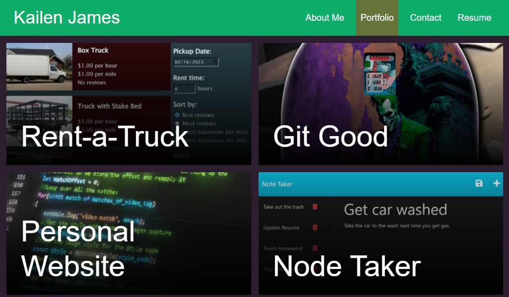

# React Portfolio

## Description

This is a single-page React app.

A personal portfolio site that can be used to show off my projects to prospective employers. Created in React, the site itself is worth putting on the portfolio.

## Table of Contents

- [Title](#title)
- [Description](#description)
- [Installation](#installation)
- [Usage](#usage)
- [License](#license)
- [Questions](#questions)

## Installation

Clone the repo to your machine and run `npm i` followed by `npm start`.

## Usage

Go to [the live application](https://loquacious-cannoli-b281ed.netlify.app/portfolio).

The tabs at the top let you browse the different pages. On the portfolio page, you can click any of the pictures to be taken to the deployed application, or you can click re to go to the github repo for that project. Some projects dont have public repos, so the button is omittted from them. When filling in the contact form, it will correctly warn you about incorrect data. Note that the data is not being sent anywhere, it is just a simulation. You can download my resume from the resume page.

## License

This project is licensed under The MIT License

## Questions

My github: [SprocketCreations](https://github.com/SprocketCreations)

